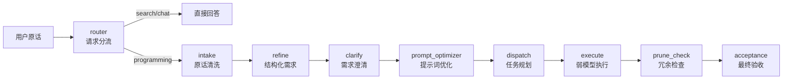

# Agent Toolkit

> 一条从「用户原话」到「可验收代码」的七阶段 Agent 管线。支持请求分流、需求澄清、任务拓扑排序、弱模型执行与自检返工。

## 核心架构



| 阶段 | 职责 | 实现方式 | 关键设计 |
|------|------|----------|----------|
| **router** | 请求分流为 programming/search/chat/tool | LLM 分类 + DuckDuckGo 搜索 | 非编程任务不进入完整管线 |
| **intake** | 去口语词、提取附件路径/URL/代码块 | Python 正则规则 | **零成本、毫秒级** |
| **refine** | 输出结构化需求 | `deepseek-v4-flash` | goal/inputs/outputs/constraints/acceptance |
| **clarify** | 发现模糊点、缺失约束、隐式假设 | `deepseek-v4-flash` | 支持项目独立领域模板 |
| **prompt_optimizer** | 转编程代理可用 prompt | `deepseek-v4-flash` | 输出 model_hint + files + tools |
| **dispatch** | 复杂任务拆解，简单任务走规则路由 | 规则判断 + 可选 LLM | 单文件任务**不调用强模型** |
| **execute** | 拓扑排序、任务隔离、自检、返工 | 弱模型 + 自检 prompt | 返工 2 次、备份恢复、可选并行 |
| **prune_check** | 扫描空目录/缓存/重复名/临时文件 | Python 规则扫描 | 只输出候选，不自动删除 |
| **acceptance** | 强模型对照原始需求验收结果 | `deepseek-v4-pro` | 最终质量闸门 |

## 技术亮点

### 1. 三层 Token 节省策略

| 层级 | 机制 | 效果 |
|------|------|------|
| **Router 分流** | 非编程任务（天气/闲聊/搜索）直接回答，不进完整管线 | 节省 6-7 次 LLM 调用 |
| **Dispatch 规则路由** | 单文件、无复杂关键词的任务直接生成单任务，不调用强模型规划 | 节省 1 次规划调用 |
| **Headroom 代理** | 所有 LLM 调用自动压缩上下文 | 节省 60-90% 上下文 token |

三层叠加后，简单任务基本只花一次 `v4-flash` 调用。

### 2. 任务拓扑排序与依赖注入

```python
# execute.py 按 depends_on 做拓扑分层，同层任务可并行
levels = _topo_levels(tasks)  # [[level0], [level1], ...]
```

- 前置任务结果自动注入后续任务上下文
- 支持 `--parallel` 同层级并发执行
- 循环依赖检测，提前报错

### 3. 自检 + 返工机制

```python
# 每个任务执行后模型自检，未通过则返工
def _execute_task(task, previous_outputs, apply, max_retries=2):
    while retries <= max_retries:
        result = _execute_once(task)
        if result.passed:
            return result
        # 返工：恢复备份 + 注入失败原因 + 重试
        _restore_file(file_path, bak_path)
        previous_outputs[f"{task_id}_retry_{retries}"] = {
            "failed_output": output, "issues": issues
        }
```

- 写文件前自动备份到 `<file>.execute.bak`
- 自检通过才清理备份，失败自动恢复
- 返工 2 次仍失败则抛异常，由上层强模型诊断

### 4. 规则路由 vs 模型路由

```python
# dispatch.py 根据任务复杂度自动选择路径
def _is_simple_task(prompt_package) -> bool:
    # 多文件 -> 复杂
    # 多个特定工具 -> 复杂
    # 提示词含"重构/架构/多文件"等关键词 -> 复杂
    # 否则 -> 简单，直接生成单任务
```

- 简单任务：毫秒级完成，零 LLM 调用
- 复杂任务：调用模型拆解，输出带依赖关系的任务列表

## 快速开始

```bash
# 1. 安装依赖
pip install -r requirements.txt

# 2. 配置 API key
export OPENAI_API_KEY="sk-xxx"

# 3. 测试最外层路由
python pipeline/router.py --raw "今天北京天气怎样"

# 4. 跑完整管线（默认只生成结果，不写文件）
python pipeline/runner.py --file input.txt

# 5. 实际写文件（execute 阶段）
python pipeline/dispatch.py --file prompt_output.json | \
  python pipeline/execute.py --apply
```

## 目录结构

```text
agent-toolkit/
├── core/
│   └── config.py              # 统一 API 配置 + Headroom 支持
├── pipeline/                  # 处理管线脚本（核心逻辑）
│   ├── router.py              # 最外层路由
│   ├── intake.py              # 原话清洗
│   ├── refine.py              # 结构化需求
│   ├── clarify.py             # 需求澄清
│   ├── prompt_optimizer.py    # 提示词优化
│   ├── dispatch.py            # 任务规划（含规则路由）
│   ├── execute.py             # 弱模型执行 + 自检 + 返工
│   ├── prune_check.py         # 冗余精简检查
│   ├── acceptance.py          # 最终验收
│   └── runner.py              # 管线串联入口
├── skills/                    # Agent 注入式 skill 说明文档
│   ├── router/
│   ├── intake/
│   ├── refine/
│   ├── clarify/
│   ├── prompt-optimizer/
│   ├── dispatch/
│   ├── execute/
│   ├── prune-check/
│   ├── acceptance/
│   ├── workflow-orchestrator/
│   ├── memory-manager/
│   └── headroom/
├── scripts/
│   ├── start_headroom.sh      # 启动 Headroom 代理
│   └── start_headroom.bat
├── tests/
│   └── test_apis.py           # API 连通性与延迟测试
├── memory/
│   └── logs/                  # 决策日志
├── workers/                   # 24h 自动化任务框架（待建）
├── requirements.txt
├── LICENSE
└── README.md
```

## 配置

所有 API 配置集中在 `core/config.py`。base URL 读取优先级：

1. `HEADROOM_PROXY_URL`（全局代理，推荐）
2. `<PROVIDER>_BASE_URL`（如 `DEEPSEEK_BASE_URL`）
3. `OPENAI_BASE_URL` / `OPENAI_API_BASE`
4. 默认值（`https://api.deepseek.com/v1`）

常用环境变量：

```bash
export OPENAI_API_KEY="sk-xxx"
export HEADROOM_PROXY_URL="http://localhost:8787/v1"

# 各节点可独立配置 API key 和模型
export REFINE_API_KEY="sk-xxx"
export DISPATCH_MODEL="deepseek-v4-flash"
export EXECUTE_MODEL="local-7b-coder"
```

## 设计原则

- **一个文件一个功能**：不要为了低耦合强行拆分。
- **一个 skill 一个职责**：`skills/` 下的每个目录只描述一个工作流节点。
- **数据、逻辑、配置分离**：配置集中在 `core/config.py`，业务逻辑在 `pipeline/`。
- **工作流七阶段固定**：`intake → refine → clarify → prompt_optimize → dispatch → execute → prune-check → accept`。
- **最外层有 `router` 分流**：先按请求类型分流，非编程任务不进入完整管线。
- **dispatch 自带路由**：简单任务直接生成单任务，不调用强模型规划。
- **记忆带版本和衰减**：旧版本只参考、不主导当前决策。

## 当前状态与规划

### 已完成

| 模块 | 文件 | 说明 |
|------|------|------|
| 最外层路由 | `pipeline/router.py` | 分流 programming/search/chat/tool，含联网搜索 |
| 原话清洗 | `pipeline/intake.py` | 规则化，不走 LLM，毫秒级 |
| 需求结构化 | `pipeline/refine.py` | 输出 goal/inputs/outputs/constraints/acceptance |
| 需求澄清 | `pipeline/clarify.py` | 发现模糊点、缺失约束、隐式假设 |
| 提示词优化 | `pipeline/prompt_optimizer.py` | 转编程代理可用 prompt |
| 任务规划 | `pipeline/dispatch.py` | 简单任务规则路由，复杂任务模型拆解 |
| 弱模型执行 | `pipeline/execute.py` | 拓扑排序、任务隔离、返工 2 次、可选并行、备份写文件 |
| 冗余检查 | `pipeline/prune_check.py` | 扫描空目录/缓存/重复名 |
| 最终验收 | `pipeline/acceptance.py` | 强模型对照原始需求验收 |
| 管线串联 | `pipeline/runner.py` | 完整七阶段串联 |

### 待办

| 优先级 | 模块 | 说明 |
|--------|------|------|
| 中 | `memory/memory.py` | 版本化记忆：current + archive + 衰减权重 |
| 中 | `workers/tasks/` | 24h 自动化任务框架 |
| 低 | `core/db.py` / `core/logger.py` | 数据库、运行日志持久化 |
| 低 | `runner.py --apply` | 让 runner 支持实际写文件开关 |

## License

MIT
